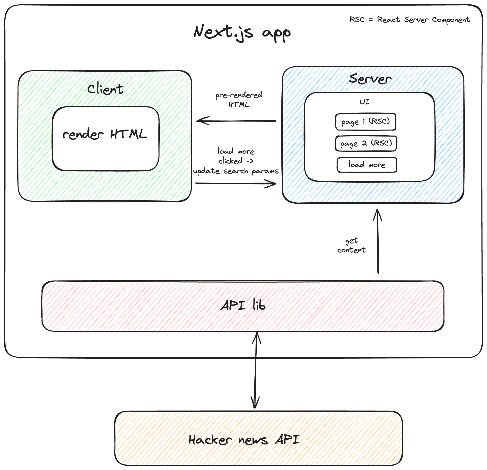

# Hacker news client using Next.js

Modern Hacker News client which offers an improved user interface while displaying data from the official Hacker News API.

⚠️ This repository is still work in progress.

| Task                        | Status |
| --------------------------- | -------|
| New page                    |   ✅   |
| Article page                |   ✅   |
| Article skeletons           |   ❌   |
| Poll page                   |   ❌   |
| Ask page                    |   ❌   |
| Jobs page                   |   ❌   |
| Show page                   |   ❌   |
| Real-time timestamp updates |   ❌   |
| Handle errors               |   🚧   |
| Storybook                   |   🚧   |
| Playwright                  |   ❌   |
| Unit tests                  |   ❌   |

## Requirements exploration

### What are the core features to be supported?

- Browse news feed, ask, show, and jobs views
- Display in-app article and poll

### What kind of posts are supported?

- An external URL (The item card itself will have a URL at the end)
- In-app article
- In-app poll

### What pagination UX should be used for the feed?

Display 20 items per page, with a simple 'More' button to load the next 20 items.

### Will the application be used on mobile devices?

Yes, the UI should be responsive. Hamburger menu should be implemented for tablet and mobile views.

## Architecture / high-level design

Using Next.js to build our Hacker News client web app provides numerous benefits, including enhanced performance, better SEO, and an improved developer experience. Features like SSR and built-in routing make it a powerful choice for creating a fast, scalable, and maintainable web application. While other frameworks like Remix are also excellent, the goal of this project is to gain experience with Next.js App Route.



### Components responsability

- **API lib**: Provides functions to interact with Hacker News API
- **Server**: Fetches the initial content and serve the pre-rendered HTML to the client to improve First Contentful Paint (FCP).
- **Client**: Display the pre-rendered HTML provided by the server
- **Page 1/Page 2**: Each page is represented by a React Server Component responsible for fetching its own data
- **Load more**: When the user clicks it, it appends the query search parameter to the URL to indicate the next page to be fetched
- **Client**: Display the pre-rendered HTML provided by the server

### Rendering approach

Traditional web applications have multiple choices on where to render the content, whether to render on the server or the client.

- **Server-side rendering (SSR)**: Rendering the HTML on the server side, which is the most traditional way. Best for static content that require SEO and does not require heavy user interaction. Websites like blogs, documentation sites, e-commerce websites are built using SSR.
- **Client-side rendering (CSR)**: Rendering in the browser, by dynamically adding DOM elements into the page using JavaScript. Best for interactive content. Applications like dashboards, chat apps are built using CSR.

As we are using Next.js, for this app we can achieve everything we need by using SSR.

More on rendering approach: <https://web.dev/articles/rendering-on-the-web>

## Data model

We will use [Zod](https://github.com/colinhacks/zod) to ensure data schema validation. Zod integration improves type safety and reduces the risk of runtime errors ensuring that incoming data meets the expected format and constraints.

| Entity      | Source      | Fields                                                                                                                            |
| ----------- | ----------- | --------------------------------------------------------------------------------------------------------------------------------- |
| `Page`      | Server      |`items` (list of item IDs), `pagination` (pagination metadata)                                                                        |
| `Item`      | Server      | `id`, `by`, `time`, `title`, `type`, `url`, `score`, `descendants`, `deleted`, `text`, `dead`, `parent`, `poll`, `kids`, `parts`  |

### Server-originated Data

The React Server Component will fetch the Page entity, render it, and serve it to the client, improving the First Contentful Paint (FCP). When the user clicks the “Load more” button, the component will display skeletons while fetching data to provide immediate feedback. Once the Page entity is fetched, it will render the list of items.

### Client-originated Data

There is no need for the client to fetch data in this app.

## Interface definition (API)

| Source          | Destination | API type   | Functionality                |
| --------------- | ----------- | ---------- | ---------------------------- |
| Hacker news API | API lib     | HTTP       | Fetch items                  |
| API lib         | Server      | Javascript | JS Functions to fetch data   |
| Server          | Client      | HTTP       | Provider the pre-render HTML |

### Hacker news API details

Reference: <https://github.com/HackerNews/API>

1. API Endpoints:
 • Top Stories: <https://hacker-news.firebaseio.com/v0/newstories.json>
 • Asks Stories: <https://hacker-news.firebaseio.com/v0/askstories.json>
 • Shows Stories: <https://hacker-news.firebaseio.com/v0/showstories.json>
 • Jobs Stories: <https://hacker-news.firebaseio.com/v0/jobstories.json>
 • Item Details: <https://hacker-news.firebaseio.com/v0/item/{item_id}.json>
2. Fetch the List of Story IDs:
  • Use one of the story list endpoints (e.g., `newstories.json`) to get an array of story IDs.
3. Fetch Details for Each Item:
 • For each story ID, fetch the item details using the `item/{item_id}.json` endpoint.

### New section example

| Field       | Value                         |
| ----------- | ----------------------------- |
| HTTP Method | `get`                         |
| Path        | `/v0/newstories.json`         |
| Description | Fetches the list of Story IDs |

Once we fetch the list of Story IDs, we can fetch the item details we want to display:

| Field       | Value                                |
| ----------- | ------------------------------------ |
| HTTP Method | `get`                                |
| Path        | `item/{item_id}.json`                |
| Description | Fetches the details of a single item |

The same procedure can be applied to Ask HN, Show and Jobs sections.

### Pagination

There are two common methods for returning paginated content, each with its own advantages and disadvantages:

- Offset-based pagination
- Cursor-based pagination

We know that the Hacker News API returns a list of Story IDs when calling the `/v0/topstories.json`.
Given the constraints of it, we are required to use offset-based pagination.

Nonetheless, it’s important to discuss the differences between offset-based and cursor-based pagination.

#### Offset-Based Pagination

Offset-based pagination specifies an offset to start retrieving data and a limit for the number of items. For example, "Start from the 10th record and give me the next 5 items." The offset can be an explicit number or derived from the requested page number. Requesting page 3 with a page size of 5 translates to an offset of 10 (2 pages before the 3rd page, 2 x 5 = 10). Typically, an offset-based pagination API accepts a `page` parameter, and the server converts it into the `offset` value for database queries.

An offset-based pagination API accepts:

| Parameter | Type   | Description              |
|-----------|--------|--------------------------|
| `size`    | number | Number of items per page |
| `page`    | number | Page number to fetch     |

For example, with 20 items in a feed and parameters {size: 5, page: 2}, the API will return items 6-10 along with pagination metadata:

```json
{
  "pagination": {
    "size": 5,
    "page": 2,
    "total_pages": 4,
    "total": 20
  },
  "stories": [
    40915005,
    40916193,
    40914475,
    40911500,
    40915082
  ]
}
```

SQL queries might look like:

```sql
SELECT * FROM posts LIMIT 5 OFFSET 0; -- First page
SELECT * FROM posts LIMIT 5 OFFSET 5; -- Second page
```

**Advantages**:

- Users can directly jump to a specific page.
- Easy to see the total number of pages.
- Simple to implement on the backend. The `OFFSET` value is calculated using `(page - 1) * size`.
- Compatible with various database systems.

**Disadvantages**:

- **Inaccurate page results**: Frequently updated data can lead to inaccuracies. For example, if a user fetches the first 5 posts and 5 more posts are added later, fetching page 2 might show duplicate posts:

    ```
    // Initial posts (newest on the left, oldest on the right)
    Posts: A, B, C, D, E, F, G, H, I, J
           ^^^^^^^^^^^^^ Page 1 contains A - E

    // New posts added over time
    Posts: K, L, M, N, O, A, B, C, D, E, F, G, H, I, J
                          ^^^^^^^^^^^^^ Page 2 also contains A - E
    ```

  Clients can try to de-duplicate posts, but this requires custom logic and additional network requests. If the number of items decreases over time, some pages might miss items.

- **Fixed page size**: Changing the page size for subsequent queries can result in missing items:

| Page | Page size | Results      |
|------|-----------|--------------|
| 1    | 5         | Items 1 - 5  |
| 2    | 5         | Items 6 - 10 |
| 2    | 7         | Items 8 - 14 |

In this example, switching from `{page: 1, size: 5}` to `{page: 2, size: 7}` skips items 6 and 7.

- **Query performance degrades over time**: As the table grows larger, query performance deteriorates. For large offsets (e.g., OFFSET 1000000), the database must read through count + offset rows, discard the offset rows, and return only the count rows. This process results in poor query performance for large offsets. Although this is backend knowledge, it’s helpful to understand and can be impressive to mention.

Offset-based pagination is commonly used in web applications to display lists like search results, where users need to jump to specific pages and the results don’t update too frequently. Therefore, blogs, travel booking websites, and e-commerce sites benefit from using offset-based pagination for their search results.

#### Cursor-based pagination

Cursor-based pagination uses a pointer (the cursor) to a specific record in a dataset. Instead of requesting "items 11 to 15," it requests "5 items starting after [specific item]."

The cursor is usually a unique identifier, such as an item ID or timestamp. Subsequent requests use the identifier of the last item as the cursor to fetch the next set of items. In SQL, an example query is:

```sql
SELECT * FROM table WHERE id > cursor LIMIT 5;
```

A cursor-based pagination API accepts the following parameters:

| Parameter | Type   | Description                                                                  |
|-----------|--------|------------------------------------------------------------------------------|
| `size`    | number | Number of results per page                                                   |
| `cursor`  | string | Identifier for the last item fetched. The database query uses this identifier |

```json
{
  "pagination": {
    "size": 5,
    "next_cursor": "=dXNlcjpVMEc5V0ZYTlo"
  },
  "results": [
    40915005,
    40916193,
    40914475,
    40911500,
    40915082
  ]
}
```

**Advantages of cursor-based pagination**:

- More efficient and faster on large datasets.
- Avoids the inaccurate page window problem because new posts added over time do not affect the offset, which is determined by a fixed cursor. This is great for real-time data.

**Downsides of cursor-based pagination**:

- Since the client doesn't know the cursor, it cannot jump to a specific page without going through the previous pages.
- Slightly more complex to implement compared to offset-based pagination.

To implement cursor-based pagination on the backend, the database needs to uniquely map the cursor to a row, which can be done using a database table's primary key or, in some cases, a timestamp.

#### Which pagination to use for this Hacker News client?

As mentioned, we don’t have control over the Hacker News API, so we should use offset-based pagination. This approach is safe since the user can’t control how many stories load when they click the “Load More” button. We’ll simply set the page size to 20.

## Optimizations and deep dive

### Design system

We have chosen to leverage [Tailwind CSS](https://tailwindcss.com/) and [shadcn/ui](https://ui.shadcn.com/) to develop the design system for our web app. These selections were made over other libraries because shadcn/ui offers a library of pre-designed components that are straightforward to integrate and customize. When combined with Tailwind CSS, this choice achieves a balance between flexible styling options and efficient reuse of components.

Reasons for Choosing shadcn/ui and Tailwind CSS:

1. **Customizability and Ease of Use:** shadcn/ui provides a collection of beautifully designed, reusable components that can be seamlessly integrated into your application. This approach saves development time by allowing quick copying and pasting of components, leveraging their accessibility and aesthetic qualities without requiring from-scratch development.

2. **Complementarity with Tailwind CSS:** shadcn/ui complements Tailwind CSS effectively. While Tailwind CSS offers utility classes for styling, shadcn/ui expands your toolkit with pre-designed components that maintain consistency and aesthetic appeal throughout your application. This combination allows you to utilize Tailwind's utility-first approach for custom styles alongside shadcn/ui's rapid deployment of polished components.

3. **Accessibility and User Experience:** By incorporating shadcn/ui, which prioritizes accessibility and customization, we ensure that our web app not only looks appealing but is also user-friendly and compliant with accessibility standards. This focus is crucial for delivering a positive user experience across diverse devices and for users with varying accessibility needs.

We will also use [Storybook](https://storybook.js.org/) to document and test them.

### Testing

We will use Playwright to test our app instead of Cypress because Playwright offers several advantages. Firstly, Playwright provides more comprehensive cross-browser support, including Chromium, Firefox, and WebKit, which ensures our app is thoroughly tested across all major browsers. Secondly, Playwright is known for its faster execution times and efficient handling of parallel test execution, leading to quicker feedback and reduced CI pipeline times.

Overall, Playwright ensures more reliable and efficient end-to-end testing.

### Accessibility

By utilizing shadcn/ui, we are prioritizing accessibility to ensure our app is inclusive for all users from the ground up.

### Error states

Clearly display error states if any network requests have failed, or when there's no network connectivity.

### Virtualized lists

Virtualized lists is a technique to optimize the rendering of long lists of data by only rendering the items that are currently visible to the user. This approach significantly improves performance and reduces memory usage compared to rendering all items at once. Virtualized lists dynamically render items as the user scrolls, ensuring a smooth and responsive user experience while efficiently handling large datasets.
We’ve decided against using a virtualized list for our app because we don't expect users to load thousands of items.

### Loading indicators

We want to show loading skeletons whenever the users is waiting for items to be fetched.

### Preserving loaded items and feed scroll position on remounting

To maintain continuity, loaded items and scroll positions in the feed should persist when users navigate away from and return to the page.
This comes out of the box with Next.js -> <https://nextjs.org/docs/app/building-your-application/routing/linking-and-navigating#6-back-and-forward-navigation>

### Stale state

Users might keep their news feed application open in a browser tab without refreshing it for extended periods. It’s good to check if the last fetched timestamp is several hours old and, if so, refetch the feed to ensure it includes any new posts and remains up to date.
This can be achievied with Next.js -> <https://nextjs.org/docs/app/building-your-application/data-fetching/fetching-caching-and-revalidating#time-based-revalidation>

### Timestamp rendering

Displaying timestamps in a relative format like “3 minutes ago” or “1 hour ago” is preferable due to its intuitive user experience, real-time updates, and space efficiency. This approach simplifies development by ensuring clarity across different time zones while maintaining concise presentation of time information.
We also want to prevent recent timestamps from becoming outdated, especially when users may not refresh the page frequently. Implementing a timer to update timestamps automatically for recent entries (less than an hour old) ensures that significant time changes are accurately reflected without requiring manual updates.

### Caching

Luckily, most of the caching work is already managed by React and Next.js. React extends fetch to automatically memoize `fetch` requests while rendering a component tree. Next.js enhances the native fetch by allowing you to configure caching and revalidation behavior for each fetch request on the server.
Resource: <https://nextjs.org/docs/app/building-your-application/data-fetching/fetching-caching-and-revalidating#fetching-data-on-the-server-with-fetch>
